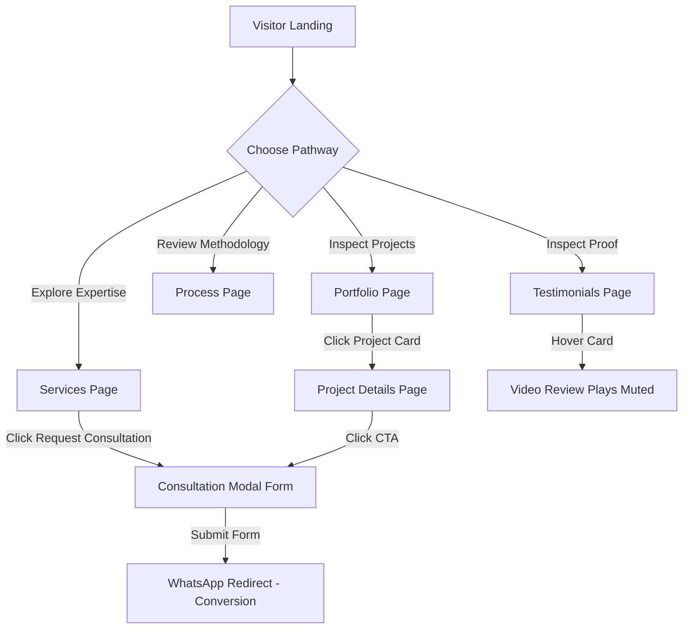
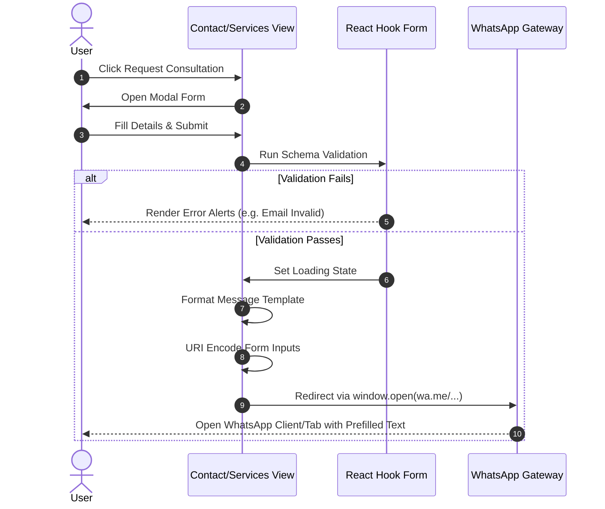
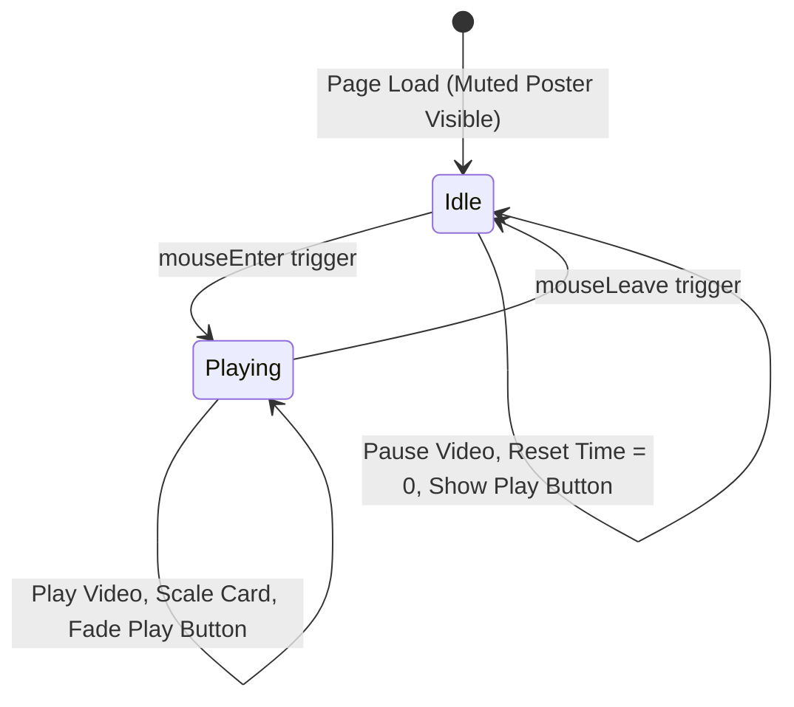

# Application User Flows & Navigation Diagrams

This document details navigation flows, booking transitions, and media loops inside Velora Interior Design.

---

## 1. User Navigation Flow
This diagram details how users explore services, view portfolio categories, and end at conversion actions.

---

## 2. Contact Form & WhatsApp Redirection Flow
Tracks the validation and message formatting pipeline.

---

## 3. Testimonials Video Loop Flow
Tracks user hover states and control updates.

